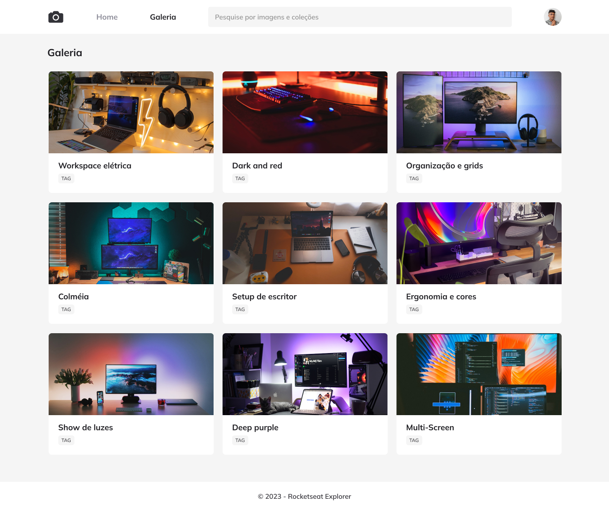

  

  

## 🖥️ Projeto
Esse é um projeto web de onde feito uma pagina web, aplicando os conceitos de grid com o header e o footer fixos, variaveis no CSS, boas praticas de acessibilidade,
tags HTML modernbas e semânticas, aplicação no CSS de filter, animation no projeto e alteração de cores com HSL .

## 🚀 Tecnologias
Esse projeto foi desenvolvido durante o curos de Explore da Rocketsat com as seguintes tecnologias:

- HTML
- CSS
- GIT E GITHUB
- FIGMA

## 🏷️layout
Você pode visualizar o layout do projeto através 
[desse link](https://www.figma.com/file/FCI9Deyoq8vF4wUbDIuqbM/Fotoblog-%E2%80%A2-Projeto-Explorer-(Community)?node-id=25%3A6&mode=dev).
É necessario ter uma conta no [Figma](https://www.figma.com).